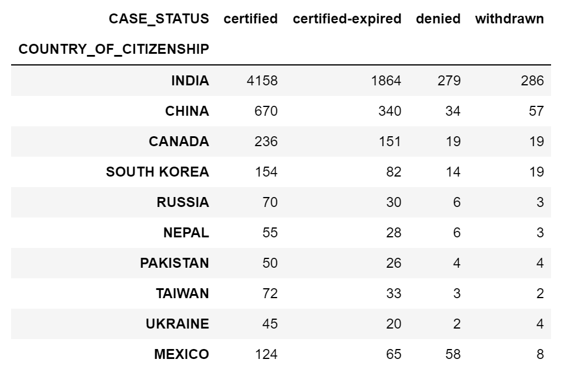
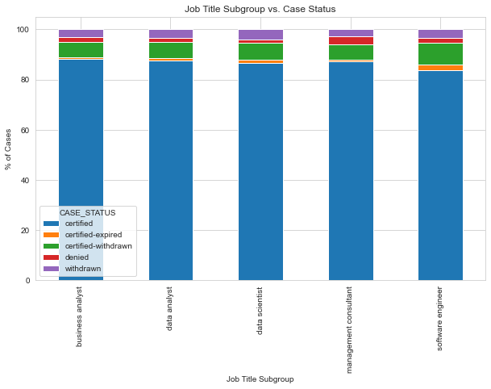

```{=html}
<style type="text/css">

h1.title {
  font-size: 38px;
  font-family: "Times New Roman", Times, serif;
  color: #2a6592;
  text-align: center;
}
h4.author { /* Header 4 - and the author and data headers use this too  */
    font-size: 18px;
  font-family: "Times New Roman", Times, serif;
  color: #2a6592;
  text-align: center;
}
h4.date { /* Header 4 - and the author and data headers use this too  */
  font-size: 18px;
  font-family: "Times New Roman", Times, serif;
  color: DarkBlue;
  text-align: center;
}
</style>
```

```{r setup, include=FALSE}
knitr::opts_chunk$set(echo = FALSE)
knitr::opts_knit$set(root.dir = "C:/Users/pauli/OneDrive/Documentos/Classes 2023/311_tech")

library(car)

```

### Question 5:

#### - Are specific job titles being offered to candidates of a specific nationality?

#### - Does the nationality of the candidate affect the status of case?

#### - Does job subtitle of the candidate affect the status o the case?

```{r}
library(readxl)
df <- read_excel("salary_data_states.xlsx", col_types = c("text", "text", "text", "text", "text", "text", "text", "text", "text", "text", "text", "text", "text", "text", "text", "text", "text", "text", "text", "text", "text", "text", "text", "text", "text", "text", "text"))

#summary(df)
```

```{r}


#names(df)
#head(df)
#View(df)
attach(df)


#summary(df)


# Count the number of missing values in each column
#sapply(df, function(x) sum(is.na(x)))


# Remove rows with missing values if needed
#cleaned_data <- na.omit(data)
# Save the cleaned data
#write.csv(cleaned_data, "cleaned_data.csv")


#unique(JOB_TITLE_SUBGROUP)

#clean the data and keep only data related jobs.
# Define the job titles you want to keep

```

# Data pre processing

It is important to notice that for this analysis we had a significant amount of missing values values on the column of interest. for instance we have a data set with 167278 observations but for column country of citizenship we have a total of 124106 missing values. Nevertheless, we will proceed with the analysis using the remaining 43172 observations.\
Since we are focusing our analysis on data related jobs we are also excluding all the job subtitles unrelated to data, as well

```{r}

JOB_TITLE_DATA <- c("software engineer", "business analyst", "management consultant", "data analyst", "data scientist")

# Filter the data to keep only the specified job titles
data <- df[df$JOB_TITLE_SUBGROUP %in% JOB_TITLE_DATA, ]

# Check the number of rows in the cleaned data
#nrow(data)
#nrow(df)


attach(data)
# Define a function to map case status to short initials
map_case_status <- function(x) {
  ifelse(x == "denied", "D", 
         ifelse(x == "certified-withdrawn", "CW",
                ifelse(x == "certified", "C",
                       ifelse(x == "withdrawn", "W", 
                              ifelse(x == "certified-expired", "CE", "U"))))) # "U" for unknown
}

# Apply the function to create a new variable
data$CASE_STATUS_SHORT <- map_case_status(data$CASE_STATUS)


# Replace "NA" with NA in the COUNTRY_OF_CITIZENSHIP column
data$COUNTRY_OF_CITIZENSHIP <- replace(data$COUNTRY_OF_CITIZENSHIP, data$COUNTRY_OF_CITIZENSHIP == "NA", NA)

dim(data)
# Omit rows with NA values
#data <- na.omit(data)
#dim(data)

```

#### - Are specific job titles being offered to candidates of a specific nationality?

In other words, we want to know if there a significant difference in number of hiring for a particular job subtitle considering country of citizenship.\
First we conducted an analysis in python looking at the top10 countries with higher hiring frequency. We then looked at the frequency of job subtitle in each of these countries.\
\


Key takeaways considering the top 10 countries with higher hiring percentage:

-   Software engineers are the most sough out professionals across the board in the top 10 countries.

-   Countries such as Canada, Russia, Taiwan, and China have over 90% of its hiring pool being directed to software engineers professionals.

-   Ukraine only hire software engineers

-   Nepal has the highest percentage of individuals working as business analysts, with over 28%. followed by Pakistan with over 18%.

-   Mexico has the highest percentage of individuals working as data analysts with over 6% of the pool of job titles.

-   Taiwan and China have the highest percentage of

-   China and Taiwan have the highest percentage of individuals working as data scientists, with over 1.4% and 1.3%.

-   Pakistan has the highest percentage of individuals working as management consultants, with over 1.3%.

    

#### - Does the nationality of the candidate affect the status of case?

We wanted to investigate whether the nationality of the candidate affects the status of the case (positive or negative) in the context of immigration applications.



The following tests aimed to investigate the relationship between nationality and case status (positive or negative) To achieve this, we categorized certified withdraw, certified-expired, and certified as positive, and denied as negative. We employed logistic regression analysis and ANOVA to assess the significance of nationality as a predictor of case status.

Our logistic regression analysis showed a significant relationship (p < 0.001) between the predictor variable (country) and the response variable (positive or negative status), as indicated by the significant intercept. However, upon analyzing the individual coefficients for different countries, not all of them were found to be significant (p > 0.05).

Given the sparse nature of the data and the non-conformity of the model assumptions, we ran a Monte Carlo simulation and a Fisher test. Both these tests yielded non-significant results. Therefore, we can conclude that the nationality of the candidate does not influence the case status in this dataset. Nonetheless, it is essential to consider other factors that may affect the case status in actual cases.

```{r}


# Select the top 10 countries by count
top_countries <- names(sort(table(data$COUNTRY_OF_CITIZENSHIP), decreasing=TRUE))[1:10]

# Filter the data frame to only include top 10 countries
df_top10 <- data[data$COUNTRY_OF_CITIZENSHIP %in% top_countries, ]

# Calculate percentage of each case status for each country
table <- table(df_top10$COUNTRY_OF_CITIZENSHIP, df_top10$CASE_STATUS)
table_pct <- prop.table(table, margin = 1) * 100


# Create a data frame from the table
status <- data.frame(
  country = rownames(table),
  certified = table[, "certified"],
  certified_expired = table[, "certified-expired"],
  denied = table[, "denied"],
  withdrawn = table[, "withdrawn"]
)

# Perform chi-squared test of independence
chisq.test(status[,-1])


#####################################################################


summarize_status <- function(status) {
  # Merge certified_expired and certified as Positive
  status$Positive <- rowSums(status[, c("certified", "certified_expired", "withdrawn")])
  
  # Remove certified_expired, certified and withdrawn columns
  status <- status[, !colnames(status) %in% c("certified", "certified_expired", "withdrawn")]
  
  # Rename denied column to Negative
  colnames(status)[colnames(status) == "denied"] <- "Negative"
  
  return(status)
}

new_status <- summarize_status(status)


model_pos <- glm(cbind(Positive,Negative) ~ factor(country), data = new_status, family = binomial)

library(brglm2)


# Check the model summary
summary(model_pos)
library(car)
Anova(model_pos)

# create contingency table
cont_table <- matrix(c(new_status$Negative, new_status$Positive), nrow = 2, byrow = TRUE)

fisher.test(cont_table, simulate.p.value = TRUE, B = 10000)


```

#### Does job subtitle of the candidate affect the status o the case?

 To begin, we used Python to create a stacked bar chart to visualize the relationship between job title subgroup and case status. The chart indicated that there may not be a significant difference in case status frequency between job title subgroups. However, to confirm this, we conducted a chi-square test for independence.


The results of the chi-square test suggested that there is a significant association between job title subgroup and case status. The extremely low p-value (< 2.2e-16) indicated that the null hypothesis of independence between the two variables can be rejected. Therefore, we can conclude that the job title subgroup of the candidate does indeed have an effect on the case status.




```{r}


# Create a contingency table of job title subgroup and case status
ct <- table(data$CASE_STATUS_SHORT, data$JOB_TITLE_SUBGROUP)

# Conduct a chi-square test of independence
res <- chisq.test(ct)

# Interpret the results
if (res$p.value < 0.05) {
  print("There is a significant association between job title subgroup and case status.")
} else {
  print("There is no significant association between job title subgroup and case status.")
}

test_result <- chisq.test(ct)

```


To further explore this, we created a mosaic graph, which provided a more detailed understanding of the relationship between job title subgroup and case status. We found that business analysts are more likely to be certified compared to software engineers, and are less likely to have their certification expired or withdrawn. Data analysts are less likely to have their certification expired or withdrawn compared to software engineers.

On the other hand, software engineers are more likely to have a denied visa and are less likely to have a certified case status compared to business analysts. They are also more likely to have their certification expired, which suggests that companies didn't move forward with the hiring after their case was certified, as well as have their certification withdrawn, indicating that the application was withdrawn before the certification was granted. In conclusion, the job title subgroup of the candidate is a significant factor affecting the status of their case, and this information could be useful for companies in their hiring process.


```{r}

# Load the necessary packages
library(vcd)

# Create the mosaic plot
mosaicplot(table(data$CASE_STATUS_SHORT, data$JOB_TITLE_SUBGROUP), shade=TRUE, 
           main="Mosaic plot of CASE_STATUS and JOB_TITLE_SUBGROUP")
```
